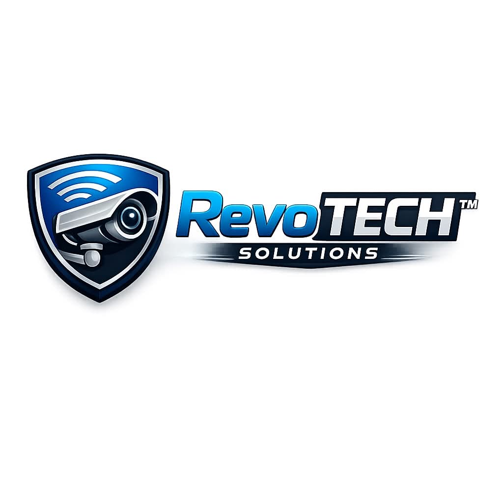

# RevoTech Solutions - Professional Electrical Services



## 🌟 About

RevoTech Solutions is a professional electrical services company offering residential, commercial, and industrial solutions across Sri Lanka. We are trusted by 450+ clients with 10+ years of experience and 2000+ completed projects.

## ✨ Features

- 🌙 **Dark/Light Theme Toggle** - Switch between themes with one click
- 📱 **Fully Responsive** - Works perfectly on all devices (mobile, tablet, desktop)
- 💌 **EmailJS Integration** - Contact form with email notifications
- ⚡ **Fast & Optimized** - Smooth animations and interactions
- 🎨 **Modern Design** - Glassmorphic UI with liquid glass effects
- 🔧 **Easy to Customize** - Well-organized code with clear sections

## 📂 File Structure

```
revotech-solutions/
├── index.html          # Main website file
├── logo.png           # Company logo
└── README.md          # This file
```

## 🚀 Quick Start

1. **Download/Clone the Repository**
   ```bash
   git clone https://github.com/yourusername/revotech-solutions.git
   cd revotech-solutions
   ```

2. **Open in Browser**
   - Simply open `index.html` in your web browser
   - No build process or dependencies required!

3. **Customize**
   - Edit company information in the HTML
   - Update contact details: Email, Phone, Address
   - Replace logo.png with your custom logo
   - Modify colors in the CSS `:root` variables

## 📧 Email Integration (EmailJS)

The contact form is pre-configured with EmailJS. The current configuration sends emails to: **dilshantharindu212@gmail.com**

To change the recipient:
1. Open `index.html`
2. Find the EmailJS initialization in the JavaScript section
3. Update the recipient email in the `templateParams`

**Current EmailJS Config:**
- Service ID: `service_in0migl`
- Template ID: `template_rzqdow9`
- Public Key: `PD8Bxa0tEm1PbizPk`
- Recipient Email: `dilshantharindu212@gmail.com`

## 📱 Contact Information

- **Phone:** 0763539267
- **Email:** akilagimhan84@gmail.com
- **Address:** 28/A, 1st Step, Narthanagala, Munagama, Horana, 12400
- **Facebook:** [Follow us](https://www.facebook.com/share/14qRDMhWJDA/)

## 🎨 Customization Guide

### Change Company Name
Find and replace "RevoTech Solutions" and "RevoTECH" throughout the HTML

### Update Colors
Edit the CSS variables at the top of the `<style>` section:
```css
:root {
  --primary: #0066ff;        /* Main blue */
  --accent: #f5a623;         /* Orange accent */
  /* ... more colors ... */
}
```

### Update Logo
1. Replace `logo.png` with your custom logo image
2. Make sure to keep the filename as `logo.png` or update the image src in HTML

### Modify Services
Edit the "What Services We Offer" section with your custom services

## 📱 Browser Support

- ✅ Chrome/Edge (Latest)
- ✅ Firefox (Latest)
- ✅ Safari (Latest)
- ✅ Mobile Browsers (iOS Safari, Chrome Mobile)

## 🔒 Security

- No backend server required
- All form data sent via EmailJS (secure)
- No sensitive data stored locally

## 📄 License

This website is created for RevoTech Solutions. All rights reserved.

## 🤝 Support

For any inquiries or modifications:
- **Phone:** 0763539267
- **Email:** akilagimhan84@gmail.com

---

**Made with ❤️ for RevoTech Solutions**

Last Updated: July 2026
